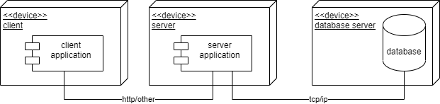
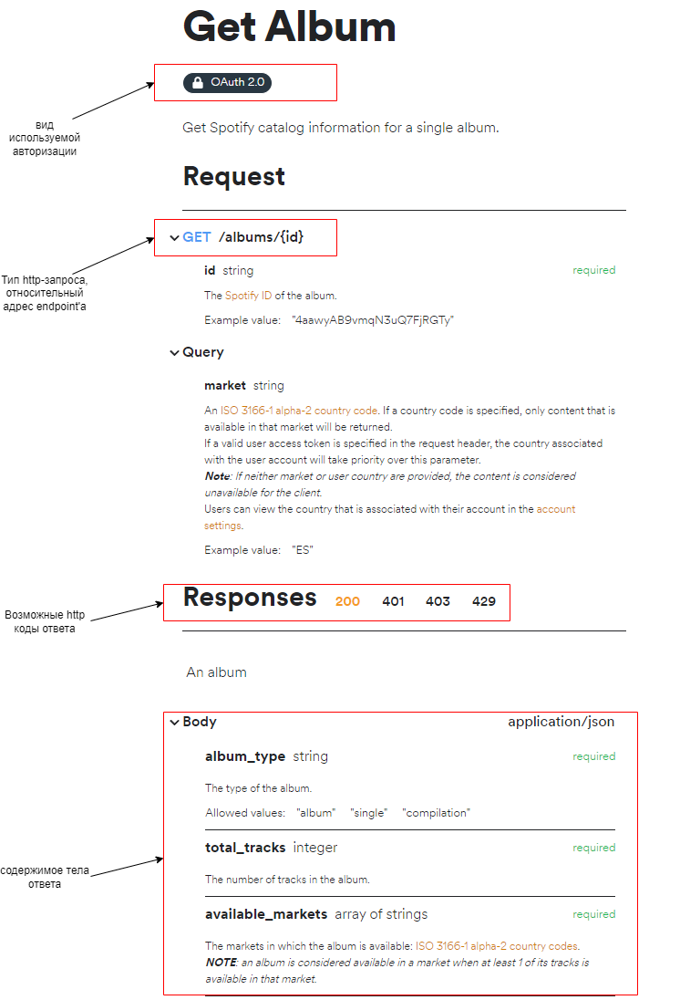

## Задание 1.

## Теория

### Трехзвенная архитектура (клиент-серверная архитектура).

Основная идея трехуровневой архитектуры заключается в разделении информационной системы на три компоненты: клиент, сервер, сервер базы данных.
В простейшей конфигурации физически сервер приложений может быть совмещён с сервером базы данных на одном компьютере, к которому по сети подключается один или несколько терминалов.
В «правильной» (с точки зрения безопасности, надёжности, масштабирования) конфигурации сервер базы данных находится на выделенном компьютере (или кластере), к которому по сети подключены один или несколько серверов приложений, к которым, в свою очередь, по сети подключаются терминалы.

Можно выделить основные преимущества использования трехзвенной архитектуры:
1. масштабируемость - один сервер может одновременно обслуживать множество клиентов, также как и один сервер баз данных может одновременно обслуживать множество серверов приложений;
2. устойчивость - изоляция уровней друг от друга позволяет быстро заменить вышедший из строя узел;
3. высокая безопасность - за счет отсутствия прямого доступа клиентов к базе данных;
4. низкие требования к клиентской машине - за счет выполнения основной бизнес-логики на сервере приложений.

Из недостатков:
1. сложность реализации;
2. сложность развертывания и поддержки.

### API
API (application programming interface) позволяет упростить процесс разработки приложений, абстрагируя базовую реализацию и предоставляя только объекты или действия, необходимые разработчику. В общем виде - это набор способов и правил, по которым различные программы общаются между собой и обмениваются данными.
Все эти взаимодействия происходят с помощью функций, классов, методов, структур, а иногда констант одной программы, к которой обращаются другие. Это основной принцип работы API.

Отличный пример API можно подробнее посмотреть, например, в музыкальном сервисе [Spotify](https://developer.spotify.com/documentation/web-api/reference/#/operations/get-an-album).

Как мы можем видеть - в документации к этому HTTP-API зафиксирован контракт взаимодействия между клиентом и сервером, описаны входные и выходные данные, а также все возможные варианты кодов ошибок, которые могут возникнуть в процессе обработки запроса клиента.

## Задание

Необходимо разработать программный продукт соответствующий следующим требованиям:
1. реализовывать трехуровневую архитектуру;
3. протокол взаимодействия между клиентом и сервером может быть любым (http, grpc и др.);
4. клиент может быть любым (браузерное приложение, мобильное приложение, компьютерное приложение)
5. клиентское приложение должно взаимодействовать с серверным через API;
6. в базе данных должно быть **не менее** 3 таблиц данных, каждая из которых должна быть задействована в бизнес-логике приложения.

Будет плюсом, если:
1. клиент и сервер будут поддерживать какой либо-механизм авторизации.

## NB!
1. Запрещено использовать следующие СУБД: **SQLite**.
2. Тематика приложения может быть любой.
3. Никаких ограничений по применямым языкам и платформам нет.

## Критерии оценки
Соответствие требованиям - максимальная оценка 25. Все остальное зависит от качества реализации.
Под качеством реализации подразумевается:
1. Семантическое качество кода. Логика структурирования, правильность декомпозиции.
2. Наличие (и выдержанность) стиля кодирования, правильность именования методов/переменных.
3. Качество финального приложения (наличие ошибок, внимание к деталям).
